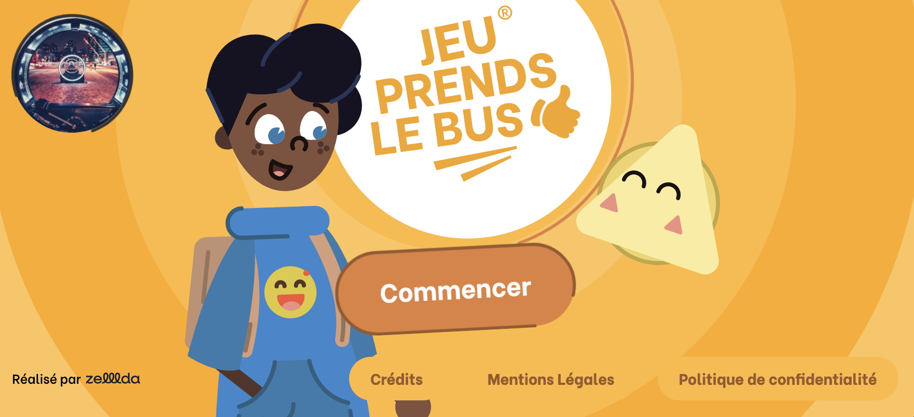

Participation au développement d'un jeu numérique et éducatif: Jeu Prends Le Bus. Au travers notamment de plusieurs mini jeux (en plus d'un jeu plateau), l'objectif est de sensibiliser le jeune public à l'usage des transports scolaires, d'apprendre les règles de vie dans les transports en commun de façon ludique et de positioner le réseau comme un acteur actif et bienveillant pour la santé des enfants. 

Le projet a été réalisé sous NuxtJs pour la partie front et Wordpress (+ ACF) pour la partie back.

## 📍 Contexte

Lorsque j'ai intégré Zelda Communication en octobre 2021, le développement et la mise en place du projet avait déjà été entammé par l'unique dev de l'agence (que j'ai remplacé). Après m'être auto-formé durant 2 mois sur les Advanced Custom Fields et sur Vuejs que je ne connaissais pas, j'ai été chargé de reprendre/terminer le projet en totale autonomie. J'ai donc entres autres été amené à:

- développer tous les mini-jeux de la dernière époque (3 époques en tout ~ 5 jeux par époque)
- mettre en place le back-office (via Wordpress et ACF) pour les jeux que j'ai développé ([exemple](https://youtu.be/QJ_lB0QcJWw?si=jqmFwVj7IvDTXSZ9))
- modifier des SVG via Illustrator afin d'ajouter calques et #id ([jeu validate](https://github.com/idrissdiakite/jeu-prends-le-bus-nuxt/tree/main/components/Game/Play/Validate))
- reprendre et mettre à jour certains jeux qui avaient déja été développé
- incorporer l'univers sonore - différentes musiques de fond en fonction du jeu et de l'époque ainsi que tous les bruitages sonores
- effectuer plusieurs recettages du Jeu afin de corriger les différents bugs

## 🎮 Mini-jeux

Exemples de mini-jeux entièrement développés par mes soins:

## [Valider son titre de transport](https://github.com/idrissdiakite/jeu-prends-le-bus-nuxt/tree/main/components/Game/Play/Validate)

**Description** 

Des usagers ont "perdu" leur titre de transport, le but est donc de le retrouver (en cliquant dessus) avant qu'ils n'atteignent le validateur. Le validateur teste toutes les 5s si l'usager est "ok" ou "ko". Si ok: le validateur passe au vert et l'utilisateur peut rentrer. Si ko: le validateur passe au rouge et l'utilisateur retourne dans la file. Et ainsi de suite jusqu'à ce qu'il n'y est plus personne dans la file.

<a href="https://youtube.com/shorts/H7zMZBFezAo?si=V4xRSQsmqXJCDdzg" target="_blank">demo</a>

## [Ne pas boire ou manger](https://github.com/idrissdiakite/jeu-prends-le-bus-nuxt/tree/main/components/Game/Play/Eatdrink)

**Description** 

Des personnages sont affichés par paire en "ombre chinoise". Il faut trouver celui qui des deux nous parait être en train de manger ou de boire (à l'aide de petits indices dissimulés). Lorsqu'on clique sur l'un des deux, l'ombre disparait et permet de découvrir si on a juste (pouce vert + effet sonore bonne réponse) ou faux (pouce rouge + effet sonore mauvaise réponse). Le jeu se termine à la fin des 3 paires.

<a href="https://youtube.com/shorts/NwjW602BTHw?si=GHPS4v0pRpt68cKq" target="_blank">demo</a>

## [Demander son arrêt](https://github.com/idrissdiakite/jeu-prends-le-bus-nuxt/tree/main/components/Game/Play/Leave)

**Description** 

Le bouton demander l'arrêt est cassé, pour le réparer il faut cliquer (dans le bon ordre) sur les symboles correspondant à celui affiché à gauche. Si le symbole cliqué est le bon, une animation apparait (avec effet sonore). Si non, le panneau éléctrique subit un "wizz". Le jeu prend fin lorsqu'on parvient à appuyer sur le bouton stop (débloqué après avoir terminé les 3 étapes).

<a href="https://youtube.com/shorts/Hw4LDhYYOxw?si=7vPNRJhz4NxqCIHH" target="_blank">demo</a>

## 🚀 Live

[http://demo.jeu-prends-le-bus.zelllda.fr/](http://demo.jeu-prends-le-bus.zelllda.fr/)
